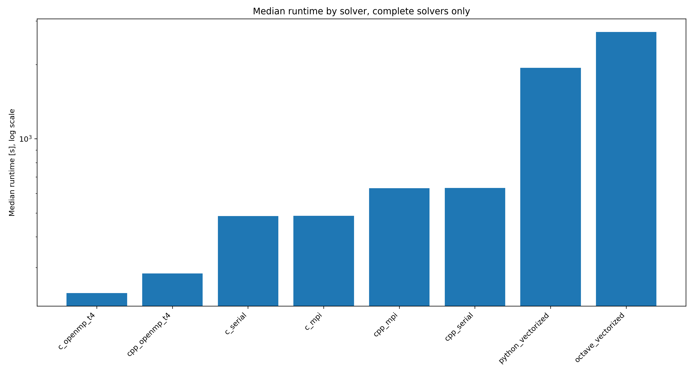
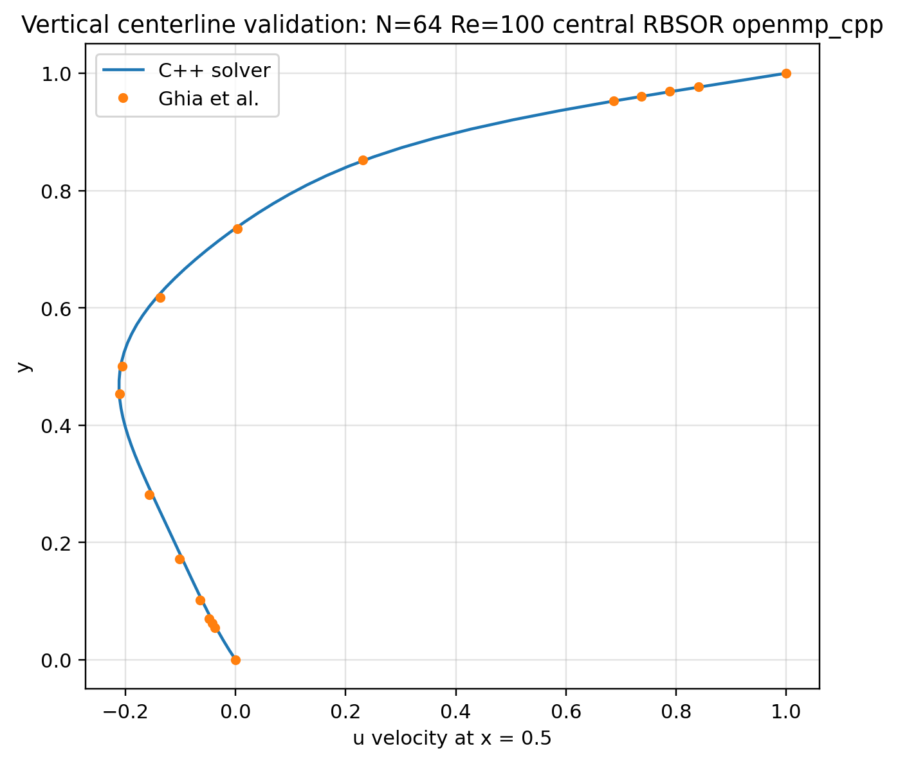
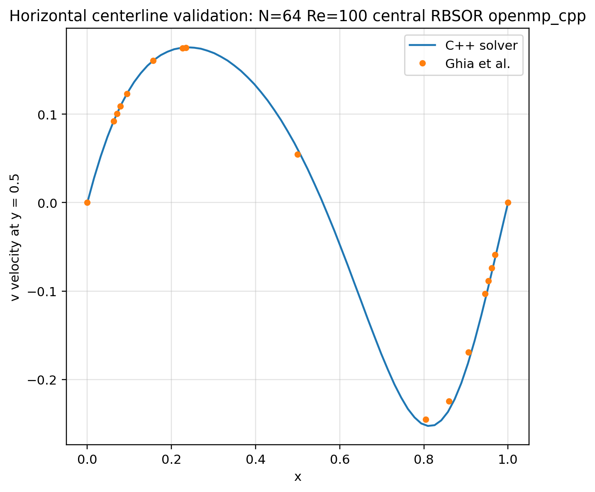
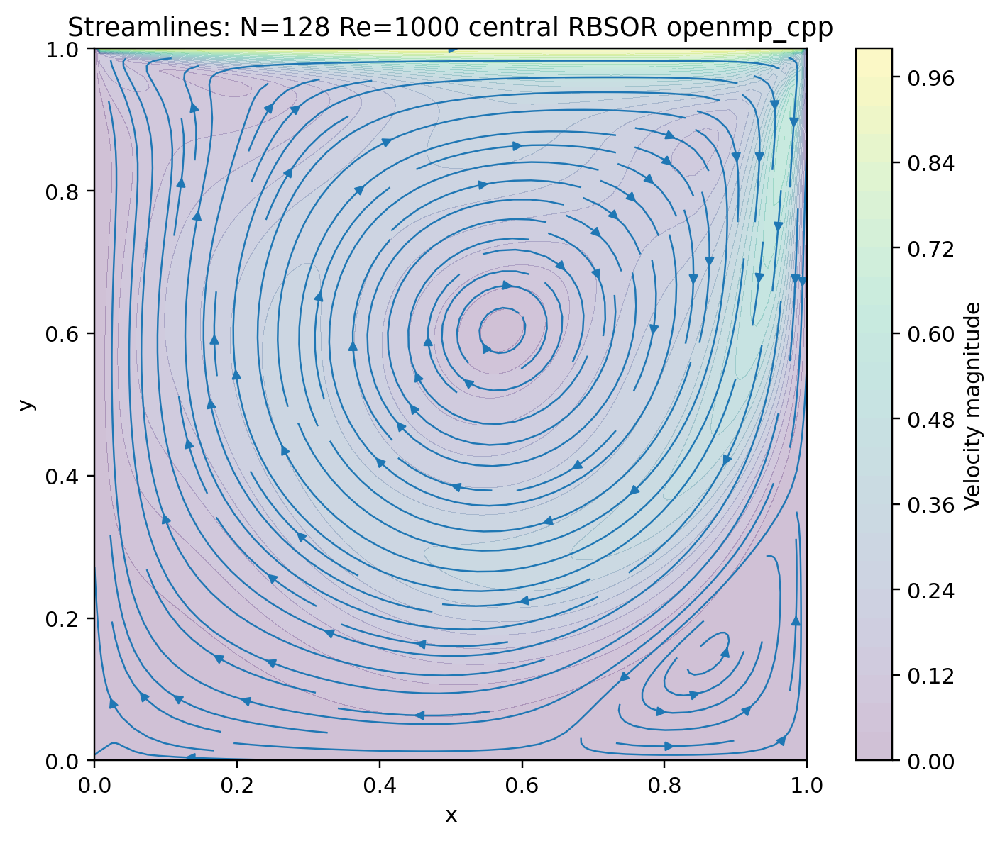

# Lid-Driven Cavity Solver Comparison


> **Project status:** This benchmark is still being developed. The current code, figures, and runtime tables document the work completed so far, but the benchmark methodology and final interpretation are not frozen yet.

A solver-focused CFD/HPC benchmark for the two-dimensional incompressible lid-driven cavity problem.

The project implements the same benchmark across MATLAB/Octave, Python, C, C++, OpenMP, MPI, and a CUDA prototype. Its purpose is to compare numerical implementation, code structure, validation metrics, runtime behavior, and parallel execution across several programming models.

## Current scope

- SIMPLE-style pressure-correction workflow for incompressible flow
- MATLAB/Octave, Python, C, and C++ implementations
- Serial, OpenMP, MPI, and CUDA-oriented workflows
- Parameter studies over mesh size, Reynolds number, convection scheme, and pressure solver
- Residual, runtime, validation, quality, and completion summaries
- Ghia centerline comparison
- Slurm workflows for the Stromboli university cluster
- Reproducible CSV-based comparison and plotting

## Important interpretation note

A case that reaches the end of its configured run is recorded as **execution-complete**. This does not automatically mean that it satisfies a numerical convergence criterion.

The benchmark is being improved to separate:

- execution status
- residual convergence
- validation-threshold status
- runtime
- iteration count
- hardware and compiler configuration

Until that separation is complete, the current runtime rankings should be read as **interim computational measurements**, not as a final time-to-convergence comparison.

## Repository structure

```text
matlab/          MATLAB/Octave reference workflow
python/          Python serial and MPI implementations
c/               C serial, OpenMP, and MPI implementations
cpp/             C++ serial, OpenMP, and MPI implementations
cuda/            CUDA prototype
comparison/      comparison scripts, current tables, and report figures
docs/            project notes, methodology, results, and reporting guides
jobs/            Slurm/HPC helper scripts
scripts/         root-level helper scripts
```

Most implementation folders follow this layout:

```text
README.md        implementation-specific notes
Makefile         build and run commands
src/             solver source code
postprocess/     plotting and post-processing scripts
results/         generated local outputs, mostly ignored by Git
```

## Numerical benchmark

The physical case is the classical lid-driven cavity:

- square cavity
- moving top lid
- no-slip side and bottom walls
- incompressible flow
- Reynolds-number-based test cases
- centerline velocity comparison with Ghia et al.

The common pressure-correction workflow is:

1. apply velocity and pressure boundary conditions
2. predict the velocity field
3. solve the pressure-correction equation
4. correct velocity and pressure
5. calculate residuals and validation metrics
6. export structured result files

## Current benchmark setup

| Parameter | Values |
|---|---|
| Grid size | `N = 32, 64, 128` |
| Reynolds number | `Re = 100, 400, 1000` |
| Convection schemes | `upwind`, `central` |
| Pressure solvers | `RBGS`, `RBSOR` |
| OpenMP setting | 4 threads |
| MPI setting | case-level parameter-study distribution |

The current cleaned result export is stored in:

```text
comparison/results/final_clean/
```

The directory name is retained from the current workflow; it does not mean that the complete project or benchmark interpretation is final.

Selected report figures are stored in:

```text
comparison/figures/report_pngs/
comparison/figures/physics_final/
comparison/figures/final_clean/
```

## Current execution-status summary

| Solver group | Executed cases | Current status |
|---|---:|---|
| `c_serial` | 36 / 36 | execution-complete |
| `cpp_serial` | 36 / 36 | execution-complete |
| `c_openmp_t4` | 36 / 36 | execution-complete |
| `cpp_openmp_t4` | 36 / 36 | execution-complete |
| `python_vectorized` | 36 / 36 | execution-complete |
| `octave_vectorized` | 36 / 36 | execution-complete |
| `c_mpi` | 36 / 36 | execution-complete |
| `cpp_mpi` | 36 / 36 | execution-complete |
| `python_looped` | 20 / 36 | incomplete |
| `octave_looped` | 34 / 36 | incomplete |
| `python_mpi` | 36 / 72 | incomplete |

This table describes collected executions. Numerical convergence and validation status must be checked separately.

## Interim runtime measurements

The current median runtimes over the collected complete case sets are:

| Rank | Solver group | Median runtime [s] |
|---:|---|---:|
| 1 | `c_openmp_t4` | 236.76 |
| 2 | `cpp_openmp_t4` | 284.40 |
| 3 | `c_serial` | 486.39 |
| 4 | `c_mpi` | 487.40 |
| 5 | `cpp_mpi` | 630.38 |
| 6 | `cpp_serial` | 631.80 |
| 7 | `python_vectorized` | 1941.31 |
| 8 | `octave_vectorized` | 2714.37 |

These numbers are hardware- and configuration-specific. They currently compare collected executions and should not yet be interpreted as a final converged-solver ranking.

## Selected figures

### Runtime comparison



### Ghia centerline comparison





### Representative high-Reynolds-number flow field



## Current observations

The collected measurements show that the compiled C and C++ implementations are faster than the Python and Octave workflows for the tested setup. OpenMP provides the lowest current median runtime among the complete CPU execution sets.

C++ with OpenMP remains the main direction for further solver development because it combines performance with clearer structure and maintainability. Python remains useful for prototyping, automation, and post-processing.

These observations remain provisional while convergence reporting, repeated measurements, and benchmark metadata are being improved.

## Quick start

From the repository root:

```bash
make help
make smoke-cpu
```

`smoke-cpu` runs small CPU checks and skips optional tools that are unavailable.

For a larger CPU run:

```bash
make quick-cpu
```

Run one implementation directly:

```bash
cd cpp/serial
make quick
```

Run an OpenMP version:

```bash
cd cpp/openmp
make quick OMP_NUM_THREADS=4
```

Run an MPI version:

```bash
cd c/mpi
make quick NP=4
```

Run the CUDA prototype on a machine with an NVIDIA GPU and CUDA toolkit:

```bash
cd cuda
make smoke
```

## Run modes

| Mode | Meaning |
|---|---|
| `smoke` | Very small build-and-start check |
| `quick` | Reduced benchmark for fast checking |
| `medium` | Larger development run |
| `full` | Full configured parameter study |
| `single` | One selected case |

Example:

```bash
cd c/serial
make run N=128 RE=400 SCHEME=upwind PRESSURE=RBGS
```

## Running on Stromboli

The Stromboli helper scripts are kept in `jobs/` and `scripts/`.

```bash
bash scripts/run_stromboli_all.sh smoke
```

For a longer run that survives a dropped SSH connection:

```bash
nohup bash scripts/run_stromboli_all.sh quick > stromboli_quick.log 2>&1 &
tail -f stromboli_quick.log
```

To skip CUDA on a CPU-only node:

```bash
RUN_CUDA=0 bash scripts/run_stromboli_all.sh quick
```

## Comparing results

After running serial implementations:

```bash
make compare-serial MODE=quick
make report-serial MODE=quick
```

Cases are matched by:

```text
mesh size, Reynolds number, convection scheme, pressure solver
```

## Parallelization scope

### MPI

The current MPI versions use case-level parallelism. Each rank receives independent benchmark cases. This accelerates parameter studies but is not spatial domain decomposition.

### OpenMP

The OpenMP versions parallelize CPU loops inside one shared-memory process. Very small cases may be slower because thread overhead dominates.

### CUDA

The CUDA implementation is a learning and comparison prototype. Its pressure-solver strategy is not yet identical to every CPU implementation, so direct performance comparisons require care.

## Requirements

Basic CPU runs require:

```text
gcc / g++
make
python3
```

Install plotting and comparison packages with:

```bash
python3 -m pip install -r requirements.txt
```

Optional tools:

```text
MATLAB or GNU Octave
OpenMPI or another MPI implementation
mpi4py
NVIDIA GPU and CUDA toolkit
```

On Windows, WSL or another Linux-style terminal is recommended.

## Documentation

| File | Purpose |
|---|---|
| `docs/PROJECT_OVERVIEW.md` | Numerical and project overview |
| `docs/IMPLEMENTATION_LAYOUT.md` | Standard implementation layout |
| `docs/RESULTS_GUIDE.md` | Explanation of result files and figures |
| `docs/RUNNING_ON_HPC.md` | HPC and Stromboli notes |
| `docs/HOW_TO_PRESENT_THIS_PROJECT.md` | Accurate wording for CVs, interviews, and posts |
| `docs/COMMUNITY.md` | Discussion categories and community guidance |
| `comparison/README.md` | Comparison-script workflow |

## Roadmap before the benchmark is considered complete

- separate execution, convergence, and validation status in every summary
- add repeated timing runs and variability statistics
- record compiler, hardware, thread, rank, and commit metadata
- improve high-Reynolds-number convergence behavior
- define one fair cross-language comparison protocol
- review the CUDA numerical equivalence
- reduce root-level script duplication
- publish a versioned benchmark release

## References

- Ghia, U., Ghia, K. N., and Shin, C. T. (1982). High-Re solutions for incompressible flow using the Navier-Stokes equations and a multigrid method. *Journal of Computational Physics*, 48(3), 387-411.
- Patankar, S. V. (1980). *Numerical Heat Transfer and Fluid Flow*. Hemisphere Publishing.
- Versteeg, H. K., and Malalasekera, W. (2007). *An Introduction to Computational Fluid Dynamics: The Finite Volume Method*. Pearson.
- Ferziger, J. H., Peric, M., and Street, R. L. (2020). *Computational Methods for Fluid Dynamics*. Springer.

## Author

Ahmed Kandil — [Portfolio](https://kandil2001.github.io/) · [LinkedIn](https://www.linkedin.com/in/ahmed-kandil03/) · [ORCID](https://orcid.org/0009-0007-2724-4565)

Released under the [MIT License](LICENSE).
