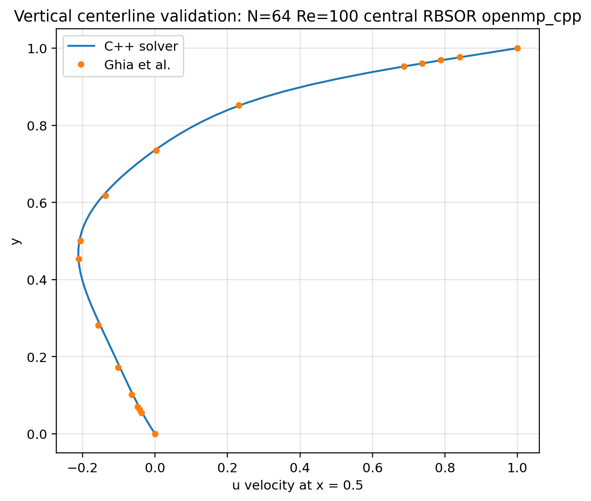
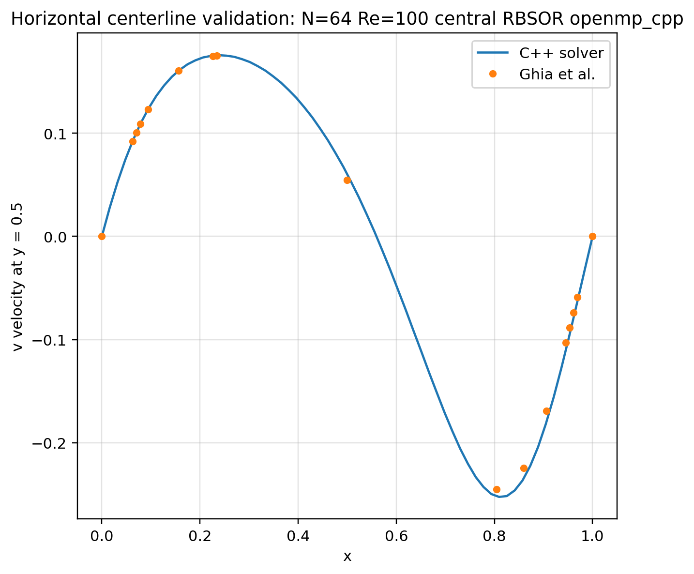

# Lid-Driven Cavity CFD and HPC Benchmark


A reproducible two-dimensional lid-driven cavity project for studying numerical implementation, language performance, shared-memory scaling, spatial MPI domain decomposition, and hybrid MPI + threading.

> **Canonical parallel benchmark:** MPI means that one computational grid is divided among ranks. MPI always means spatial decomposition of one CFD grid; parameter-sweep scheduling is not treated as a solver implementation.

## What is in the repository

| Track | Formulation | Location | Role |
|---|---|---|---|
| Domain-scaling benchmark | Streamfunction–vorticity, fixed-step runs | `src/`, `hpc/stromboli/`, `results/final/` | Canonical OpenMP, MPI domain-decomposition, and hybrid performance study |
| Pressure-correction reference | Explicit pseudo-time pressure correction | `matlab/`, `python/serial/`, `c/serial/`, `c/openmp/`, `cpp/serial/`, `cpp/openmp/`, `comparison/` | Earlier cross-language work and Ghia-profile validation evidence |
| CUDA prototype | Projection-style CUDA implementation | `cuda/`, `results/cuda/` | Experimental GPU work; current archived validation does not pass the configured thresholds |

The numerical tracks are documented separately because different formulations and stopping rules must not be combined into one “fastest solver” ranking.

## Repository layout

```text
src/
├── c/
│   ├── openmp_domain_looped/
│   ├── openmp_domain_vectorized/
│   ├── mpi_domain_looped/
│   ├── mpi_domain_vectorized/
│   ├── hybrid_mpi_openmp_looped/
│   └── hybrid_mpi_openmp_vectorized/
├── cpp/                         same six compiled variants
└── python/
    ├── mpi_domain_looped/
    ├── mpi_domain_vectorized/
    ├── hybrid_mpi_openmp_looped/
    └── hybrid_mpi_openmp_vectorized/

hpc/stromboli/                  Slurm entry points for the domain benchmark
results/final/                  complete archived fixed-step result package
results/selected/               small README-facing result set
scripts/                        build, run, checking, and post-processing tools

a matlab/, python/serial/, c/serial/, c/openmp/, cpp/serial/, cpp/openmp/
                               earlier pressure-correction reference track
```

## Clean build and smoke test

Requirements for the full CPU workflow:

```text
gcc, g++, make
OpenMPI: mpicc, mpicxx, mpirun
Python 3 with numpy, pandas, matplotlib, and mpi4py
```

Install the pinned CI environment:

```bash
python3 -m pip install -r .github/requirements-ci.txt
```

Rebuild every compiled grid-decomposition implementation from scratch:

```bash
make rebuild-domain
```

Run the complete small CPU test matrix:

```bash
make smoke-cpu NP=2 OMP_NUM_THREADS=2 NUMBA_NUM_THREADS=2
```

Useful narrower commands:

```bash
make smoke-reference       # earlier serial/OpenMP pressure-correction track
make smoke-domain-openmp   # C and C++ domain OpenMP
make smoke-domain-mpi      # C, C++, and Python spatial MPI
make smoke-domain-hybrid   # C, C++, and Python hybrid decomposition
make selected-results      # regenerate README tables/figures; runs no CFD
```

## Selected archived grid-decomposition results

The README highlights one representative, repeated, largest-grid configuration that is present across the archived scaling package:

```text
N = 128
Re = 400
central convection
RBSOR
2500 outer steps
250 Poisson iterations per step
3 repetitions per resource configuration
```

| Implementation | Best archived configuration | Median runtime | Speedup vs 1 core | Efficiency |
|---|---:|---:|---:|---:|
| C OpenMP vectorized | 4 threads | 6.688 s | 2.346× | 58.6% |
| C++ OpenMP vectorized | 4 threads | 6.627 s | 2.348× | 58.7% |
| Python MPI domain vectorized | 16 ranks | 53.748 s | 6.202× | 38.8% |
| Python hybrid vectorized | 4 ranks × 2 threads | 109.364 s | 3.003× | 37.5% |

### What these results show

- C and C++ OpenMP performance is effectively the same for the selected vectorized workload.
- Four OpenMP threads are the useful point in this case; adding more threads increases runtime.
- Python pure MPI outperforms the archived Python hybrid configuration for this workload.
- The archived OpenMP package is complete: 2,160 successful rows and no failed rows.
- The archived MPI and hybrid packages contain many failed or timed-out rows. Every retained successful distributed-memory row is Python.
- Historical C/C++ MPI and hybrid jobs failed to rebuild. Their compiler-wrapper Makefiles are repaired in this branch, but those configurations must be rerun before a cross-language MPI comparison is reported.

The generated source tables are in [`results/selected/`](results/selected/README.md). Regenerate them from the existing archive with:

```bash
python3 scripts/generate_selected_results.py
```

That command reads CSV files only; it does not execute CFD cases.

## Scientific interpretation

The selected domain results are **fixed-step performance measurements**. They are useful for studying implementation cost and strong-scaling behavior, but they are not yet convergence-controlled time-to-solution results.

A process exit code, a written CSV row, and a numerically validated flow field are separate conditions. The repository therefore distinguishes:

- execution completion;
- convergence information, when available;
- validation against reference data;
- repeated runtime statistics.

The earlier pressure-correction track contains useful Ghia centerline evidence, including:





Those figures belong to the pressure-correction reference track and are not used to validate the streamfunction–vorticity timing archive.

## Running the domain benchmark

Run one explicit spatial-MPI implementation:

```bash
make -C src/cpp/mpi_domain_vectorized run \
  NP=4 N=128 RE=400 STEPS=2500 POISSON_ITERS=250 \
  SCHEME=central POISSON_SOLVER=RBSOR NO_FIELDS=1
```

Run one hybrid implementation:

```bash
make -C src/cpp/hybrid_mpi_openmp_vectorized run \
  NP=4 OMP_NUM_THREADS=2 N=128 RE=400 \
  STEPS=2500 POISSON_ITERS=250 SCHEME=central \
  POISSON_SOLVER=RBSOR NO_FIELDS=1
```

For Stromboli, package the source locally, upload it without Git, and use the scripts under `hpc/stromboli/`. See [`docs/RUNNING_ON_HPC.md`](docs/RUNNING_ON_HPC.md).

## Results policy

The root README intentionally contains only the most relevant evidence. Detailed raw and secondary results remain under `results/final/` for traceability.

Headline comparisons must preserve all of these dimensions:

```text
language
parallel model
kernel style
pressure solver
grid and Reynolds number
step and Poisson-iteration counts
MPI ranks and threads
repetition count
```

Medians and variability are preferred over the minimum observed runtime.

## Current limitations and reruns still required

1. Rebuild and rerun C and C++ MPI/hybrid domain cases after the compiler-wrapper repair.
2. Add one common convergence-controlled protocol before making time-to-solution claims.
3. Validate the streamfunction–vorticity domain solvers against accepted cavity reference quantities.
4. Repair and revalidate CUDA before reporting CPU/GPU speedup.
5. Freeze compiler flags, hardware metadata, warm-up policy, and repetition count for the paper dataset.

## Documentation

- [`docs/BENCHMARK_TRACKS.md`](docs/BENCHMARK_TRACKS.md) — numerical-track boundaries
- [`docs/IMPLEMENTATION_LAYOUT.md`](docs/IMPLEMENTATION_LAYOUT.md) — canonical source layout
- [`docs/CURRENT_BENCHMARK_RESULTS.md`](docs/CURRENT_BENCHMARK_RESULTS.md) — evidence and limitations
- [`docs/RESULTS_GUIDE.md`](docs/RESULTS_GUIDE.md) — where each result belongs
- [`docs/RUNNING_ON_HPC.md`](docs/RUNNING_ON_HPC.md) — no-Git Stromboli workflow
- [`results/final/README_FINAL_STATUS.md`](results/final/README_FINAL_STATUS.md) — full archived execution status

## References

- Ghia, U., Ghia, K. N., and Shin, C. T. (1982). High-Re solutions for incompressible flow using the Navier–Stokes equations and a multigrid method. *Journal of Computational Physics*, 48(3), 387–411.
- Patankar, S. V. (1980). *Numerical Heat Transfer and Fluid Flow*. Hemisphere Publishing.
- Ferziger, J. H., Perić, M., and Street, R. L. (2020). *Computational Methods for Fluid Dynamics*. Springer.

## Author

Ahmed Kandil — [Portfolio](https://kandil2001.github.io/) · [LinkedIn](https://www.linkedin.com/in/ahmed-kandil03/) · [ORCID](https://orcid.org/0009-0007-2724-4565)

Released under the [MIT License](LICENSE).
