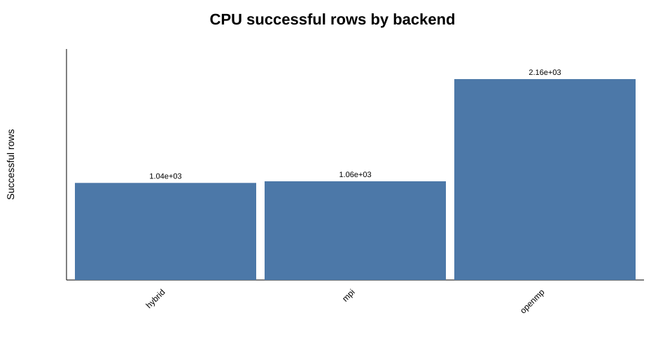

# Lid-Driven Cavity Solver Comparison


A research and learning repository for the two-dimensional incompressible lid-driven cavity problem, with implementations in Python, C, C++, MATLAB/Octave, MPI, OpenMP, hybrid parallel models, and CUDA.

> **Scientific status:** The repository contains substantial code, execution logs, validation plots, and repeated performance measurements. It does **not** yet contain one frozen, fully verified, convergence-controlled benchmark suitable for a final cross-language paper. In the current result files, a successful process execution is not automatically a numerically converged or validated CFD solution.

## Repository at a glance

The repository now contains two related but numerically different benchmark tracks.

| Track | Numerical formulation | Main locations | Purpose | Current status |
|---|---|---|---|---|
| Cross-language solver track | Explicit pseudo-time pressure-correction / projection-style method | `matlab/`, `python/`, `c/`, `cpp/`, `cuda/`, `comparison/` | Compare language implementations, residual histories, Ghia profiles, and runtime | Useful pilot dataset; many cases reached their iteration limit before convergence |
| Domain-scaling track | Streamfunction–vorticity formulation for the CPU domain solvers | `src/`, `hpc/`, `results/final/` | Repeated OpenMP, MPI, and hybrid scaling experiments | Large performance dataset; execution completeness and numerical validation still need to be separated carefully |

These tracks must not be combined into a single “fastest solver” claim without first matching the numerical method, stopping condition, output definition, and validation protocol.

The CPU domain solvers use streamfunction–vorticity, while the current CUDA A100 files are labelled as projection-based RBGS/RBSOR implementations. Their runtimes are therefore engineering measurements from different formulations, not an apples-to-apples CPU/GPU algorithm comparison.

## Current evidence

### 1. Cross-language pressure-correction pilot

The original benchmark matrix uses:

| Parameter | Values |
|---|---|
| Grid size | `N = 32, 64, 128` |
| Reynolds number | `Re = 100, 400, 1000` |
| Convection | `upwind`, `central` |
| Pressure solver | `RBGS`, `RBSOR` |
| OpenMP | 4 threads in the cleaned pilot dataset |
| MPI | Case-level parameter-study distribution |

The cleaned pilot data is stored under:

```text
comparison/results/final_clean/
comparison/figures/report_pngs/
comparison/figures/physics_final/
```

Several C, C++, OpenMP, and vectorized Python/Octave groups contain all 36 configured executions. However, the current quality counts for the main complete groups are typically:

```text
14 cases: needs_improvement
22 cases: validated_but_not_converged
0 cases: converged_and_validated
```

The existing runtime table is therefore an **execution-time comparison**, not a final time-to-convergence ranking.

### 2. Repeated CPU domain-scaling dataset

The newer scaling archive contains 18 physical/configuration cases and repeated runs over multiple core counts.

| Family | Successful rows | Failed or time-limited rows | Interpretation |
|---|---:|---:|---|
| OpenMP | 2,160 | 0 | Complete execution dataset for the configured C/C++ domain solvers |
| MPI | 1,061 | 2,140 | About one third of collected rows succeeded; case 13 includes salvaged successful rows |
| Hybrid MPI + threading | 1,044 | 2,100 | About one third of collected rows succeeded; case 13 includes salvaged successful rows |

Files:

```text
results/final/README_FINAL_STATUS.md
results/final/comparisons/cpu_completeness_status.csv
results/final/comparisons/cpu_successful_runtime_rows.csv
results/final/cpu_case_summaries/
results/final/figures/
```

The OpenMP dataset is the cleanest execution dataset in the repository. Representative large-grid reports show useful speedup up to a moderate thread count, followed by sharply decreasing efficiency at higher thread counts. Small cases are often dominated by threading overhead.

### 3. CUDA A100 dataset

The exact RBGS/RBSOR CUDA archive contains 108 result rows across the 18 cases and two pressure solvers.

All 108 rows currently have:

```text
ValidationPass = 0
```

The CUDA timings can be studied as implementation measurements, but they must not be presented as validated CFD performance results yet.

Files:

```text
results/cuda/cuda_validation_summary.csv
results/cuda/cuda_cpu_exact_full_summary.csv
results/final/comparisons/cuda_runtime_summary.csv
```

## What can currently be concluded

The repository supports the following cautious conclusions:

- The compiled C and C++ implementations are much faster than the interpreted loop-based workflows in the original pilot setup.
- The repeated OpenMP domain runs are substantially more complete than the current MPI and hybrid datasets.
- OpenMP scaling is useful for the larger configured cases, but efficiency decreases strongly when thread overhead and synchronization dominate.
- The current Python MPI and hybrid domain runs have a high failure or time-limit rate and should not be used as the headline comparison.
- RBSOR often has lower measured runtime than RBGS in the collected fixed-step domain runs, but accuracy and convergence equivalence must be checked before treating that as a final solver conclusion.
- The CUDA data is not yet validated against the configured Ghia thresholds.

The repository does **not** yet support these claims:

- a final fastest-language ranking;
- a validated CPU-versus-GPU speedup;
- a fair comparison between pressure-correction and streamfunction–vorticity implementations;
- a final time-to-convergence result;
- a publishable scaling conclusion based only on the minimum observed runtime.

## Important reporting limitations

### Execution success is not numerical convergence

For the domain-scaling files, `status=success` means the command completed and produced a summary row. The runs use configured step counts and report final streamfunction/vorticity changes; they do not yet apply one common cross-language convergence decision.

### Current “best runtime” tables are exploratory

Some final comparison tables select the minimum successful runtime per backend and case. This can collapse language, kernel style, pressure solver, core count, and repeat into one value. A paper-quality result should instead compare fixed configurations using repeated measurements, medians, and uncertainty intervals.

### Strong-scaling reports need a pressure-solver dimension

The raw scaling summaries distinguish `RBGS` and `RBSOR`, but some Markdown reports and plots do not show the pressure solver in their grouping or legend. This creates duplicate-looking rows and can connect unrelated points in a plot.

### The repository was reorganized after the original benchmark

The root `Makefile` still controls the original top-level implementation folders. The newer organized source snapshot is under `src/`, while several scaling scripts still contain pre-reorganization paths. The domain-scaling workflow should be normalized before it is rerun from a clean checkout.

## Repository structure

```text
README.md                 project overview and interpretation
Makefile                  original cross-language workflow

matlab/                   MATLAB/Octave pressure-correction reference
python/                   original Python serial and case-level MPI solvers
c/                        original C serial/OpenMP/case-level MPI solvers
cpp/                      original C++ serial/OpenMP/case-level MPI solvers
cuda/                     original CUDA/projection implementation
comparison/               original comparison scripts, pilot tables, and figures

src/                      organized domain-solver source snapshot
hpc/stromboli/            Slurm scripts for repeated scaling studies
data/cases/               fixed case definitions
results/final/             repeated CPU/CUDA performance archive
results/cuda/              CUDA summaries and Ghia validation table
results/audits/            repository and result audits

scripts/                  run, aggregation, audit, and post-processing tools
docs/                     methodology and project documentation
```

## Quick start: original cross-language track

Basic requirements:

```text
gcc / g++
make
python3
```

From the repository root:

```bash
make help
make smoke-cpu
```

Run one C++ serial smoke test:

```bash
cd cpp/serial
make smoke
```

Run a selected C++ case:

```bash
cd cpp/serial
make run N=64 RE=100 SCHEME=central PRESSURE=RBSOR
```

Install comparison and plotting packages with:

```bash
python3 -m pip install -r requirements.txt
```

Optional tools include GNU Octave or MATLAB, OpenMPI, `mpi4py`, and an NVIDIA CUDA toolkit.

## Working with the archived scaling results

Start with:

```text
results/final/README_FINAL_STATUS.md
results/final/README_PLOTS_AND_COMPARISONS.md
results/final/comparisons/cpu_completeness_status.csv
results/final/cpu_all_best_by_solver.csv
results/cuda/cuda_validation_summary.csv
```

Do not rely only on:

```text
results/final/comparisons/combined_best_runtime_by_case_backend.csv
```

That table records the minimum runtime found for each broad backend and case; it is useful for exploration but not a fair paper result.

## Representative figures

### Pressure-correction Ghia comparison


### Domain-run completion summary



## Paper-oriented development

The paper-focused work is being developed separately in:

```text
agent/paper-benchmark-foundation
```

The intended paper contribution is not a new cavity algorithm. It is a reproducible comparison of the same simple pressure-correction algorithm in:

- Python/NumPy;
- C;
- C++;
- optional Rust, after toolchain availability is confirmed;
- OpenFOAM as a separate external reference.

MATLAB/Octave is retained as previous work but is not required for the main Stromboli paper matrix.

Before the paper branch can be merged, it must be refreshed against the current `main` branch and must explicitly separate the new streamfunction–vorticity scaling archive from the pressure-correction paper protocol.

## Required work before publication

1. Select one numerical formulation for the headline cross-language comparison.
2. Produce one fully converged and validated C++ serial reference case.
3. Add analytical operator and Poisson verification tests.
4. Use odd grids or interpolation for exact cavity centerlines.
5. Apply the same boundary conditions, initialization, stopping conditions, and precision in every language.
6. Compare converged fields across languages before timing them.
7. Record solver time separately from output and process startup.
8. Use a warm-up plus repeated measurements and report median, IQR, and hardware/compiler metadata.
9. Fix scaling reports so pressure solver, language, kernel style, and core configuration are never collapsed accidentally.
10. Validate CPU and CUDA results using the same physical and numerical acceptance rules before making a GPU speedup claim.
11. Normalize the post-reorganization paths under `src/` and remove generated binaries, caches, and duplicate source snapshots from the publication release.
12. Create a tagged release with archived raw data and a DOI.

## Documentation

| File | Purpose |
|---|---|
| `docs/CURRENT_BENCHMARK_RESULTS.md` | Original pressure-correction pilot results |
| `docs/PROJECT_OVERVIEW.md` | Original numerical-method overview |
| `docs/RESULTS_GUIDE.md` | Original result-file guide |
| `docs/RUNNING_ON_HPC.md` | HPC notes |
| `results/final/README_FINAL_STATUS.md` | Current repeated CPU/CUDA execution status |
| `results/final/README_PLOTS_AND_COMPARISONS.md` | Current final-archive table and figure index |
| `results/audits/` | Detailed result and repository audits |

## References

- Ghia, U., Ghia, K. N., and Shin, C. T. (1982). High-Re solutions for incompressible flow using the Navier–Stokes equations and a multigrid method. *Journal of Computational Physics*, 48(3), 387–411.
- Patankar, S. V. (1980). *Numerical Heat Transfer and Fluid Flow*. Hemisphere Publishing.
- Versteeg, H. K., and Malalasekera, W. (2007). *An Introduction to Computational Fluid Dynamics: The Finite Volume Method*. Pearson.
- Ferziger, J. H., Perić, M., and Street, R. L. (2020). *Computational Methods for Fluid Dynamics*. Springer.

## Author

Ahmed Kandil — [Portfolio](https://kandil2001.github.io/) · [LinkedIn](https://www.linkedin.com/in/ahmed-kandil03/) · [ORCID](https://orcid.org/0009-0007-2724-4565)

Released under the [MIT License](LICENSE).
